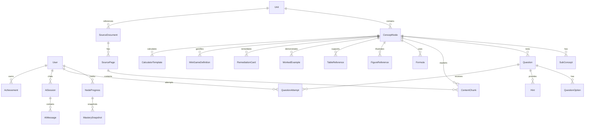

# خطة تنفيذ: الخارطة المفاهيمية التكيفية — الطاقة في التفاعلات الكيميائية

## نظرة عامة

بناء منصة تعليمية تفاعلية تكيفية كاملة لطلاب الصف العاشر، تغطي **وحدة الطاقة في التفاعلات الكيميائية**. المنصة تتضمن خارطة مفاهيمية بصرية تكيفية، محرك تعلم ذكي، معلم AI، ألعاب تفاعلية، حاسبات كيميائية، ولوحة تحكم إدارية، مبنية بمعمارية Monorepo احترافية.

---

## تحليل المصادر المرفقة

### 1. ملف الوحدة العلمي (chm10.pdf) — 22 صفحة
**المحتوى المستخرج:**
- **الوحدة الخامسة:** الطاقة في التفاعلات الكيميائية
- **الأهداف التعليمية:** تصنيف التفاعلات، حساب الطاقة، كتابة المعادلة الحرارية، القيمة الحرارية، برنامج غذائي
- **الأقسام:** 6 دروس رئيسية (5-1 إلى 5-6) + أنشطة + مشروع
- **الجداول:** جدول 5-1 (طاقات الروابط)، جدول 5-2 (حرارة الاحتراق)، جدول 5-3 (القيمة الحرارية للوقود)، جدول 5-4 (القيمة الحرارية للغذاء)
- **الأمثلة المحلولة:** مثالان تفصيليان لحساب حرارة التفاعل (H₂+F₂ و CH₄+O₂)
- **الأسئلة:** 10 أسئلة نهائية متنوعة + أسئلة داخل كل درس
- **المعادلات الكيميائية:** 15+ معادلة حرارية
- **التطبيقات الحياتية:** الكمادات الساخنة والباردة (CaCl₂ و NH₄NO₃)
- **المشروع:** برنامج غذائي أسبوعي قائم على السعرات الحرارية

### 2. وثيقة التصميم (DOCX) — 344 فقرة
**المحتوى المستخرج:**
- **10 عقد** تعليمية مفصّلة مع: تمهيد، سؤال فهم، سؤال تطبيق، سؤال استدلال، تلميحات، مسار صحيح، مسار خطأ، مستوى أعلى
- **خوارزمية التكيف** كاملة (5 مسارات قرار)
- **4 ألعاب تفاعلية** محددة: محاكاة المسعر، لغز المطعم، تحدي الغاز/الخشب، مشروع السعرات
- **إرشادات UI/UX** تفصيلية
- **أنماط الدعم** (3 مستويات: فهم، تطبيق، استدلال)
- **نظام تتبع التقدم** (نسبة الإنجاز، الإتقان، المحاولات، التلميحات)

### 3. الخريطة المفاهيمية (22.jpeg)
**البنية المرئية المستخرجة:**
```
الطاقة في التفاعلات الكيميائية (العقدة المركزية)
├── تغيرات الطاقة
│   ├── أشكال الطاقة (حرارة، ضوء)
│   ├── تفاعلات طاردة للحرارة
│   └── تفاعلات ماصة للحرارة
├── المحتوى الحراري (ΔH)
│   ├── طاقة المواد المتفاعلة والناتجة
│   ├── إشارة ΔH (سالبة للطارد، موجبة للماص)
│   └── التمثيل البياني لتغيرات الطاقة
├── المعادلة الكيميائية الحرارية
│   ├── كتابة الحرارة مع النواتج أو المتفاعلات
│   ├── دلالة القيمة العددية لـ ΔH
│   └── موازنة المعادلة الحرارية
├── طاقة الرابطة
│   ├── كسر الروابط (امتصاص طاقة)
│   ├── تكوين الروابط (إطلاق طاقة)
│   └── قوة الرابطة وعدد الروابط
├── حساب حرارة التفاعل
│   ├── مجموع الروابط المكسورة - المتكونة = ΔH (قانون)
│   ├── استخدام جداول طاقة الروابط
│   └── العلاقة بين عدد المولات وكمية الطاقة
├── حرارة الاحتراق والوقود
│   ├── تعريف حرارة الاحتراق (مول واحد)
│   ├── المقارنة بين أنواع الوقود (ميثان، هيدروجين)
│   └── كفاءة إنتاج الطاقة
├── الكيمياء الخضراء ⚠️ [needs-review]
│   ├── مفهوم اقتصاد الذرة
│   ├── كفاءة التفاعل وتقليل التلوث
│   └── تفاعلات صديقة للبيئة (100%)
└── تطبيقات حياتية
    ├── الكمادات الساخنة (طاردة للحرارة)
    ├── الكمادات الباردة (ماصة للحرارة)
    ├── القيمة الحرارية للغذاء (دهون، كربوهيدرات)
    └── حساب السعرات الحرارية اليومية
```

> [!IMPORTANT]
> **عقدة الكيمياء الخضراء** موجودة في الخريطة المفاهيمية لكنها **غير مفصّلة** في ملف الوحدة PDF. سيتم إنشاؤها بعلامة `needs-review` كامتداد مستقبلي.

---

## قرارات المعمارية

| القرار | الاختيار | المبرر |
|--------|---------|--------|
| بنية المشروع | pnpm Workspace Monorepo | أخف من Turborepo للمشروع الحالي، native workspace support |
| Frontend | React 18 + Vite + TypeScript | سرعة بناء، HMR ممتاز، TypeScript strict |
| Styling | Tailwind CSS v4 + shadcn/ui | تصميم سريع، RTL ممتاز، مكونات جاهزة عالية الجودة |
| الرسوم المتحركة | Framer Motion | أنيميشن سلس ومناسب لفئة الصف العاشر |
| الخارطة المفاهيمية | @xyflow/react (React Flow) | مكتبة ناضجة لتمثيل الخرائط المفاهيمية التفاعلية |
| إدارة الحالة | Zustand | خفيف، TypeScript-native، لا boilerplate |
| طلبات API | TanStack Query v5 | تخزين مؤقت ذكي، invalidation، optimistic updates |
| النماذج | React Hook Form + Zod | validation تفاعلي، type-safe |
| الرسوم البيانية | Recharts | RTL support، خفيفة، سهلة |
| Backend | NestJS + TypeScript | معمارية modules، decorators، guards، interceptors |
| ORM | Prisma | type-safe queries، migrations، seeding |
| قاعدة البيانات | PostgreSQL 16 + pgvector | production-grade، vector search للمعلم الذكي |
| Cache & Queue | Redis (اختياري) | rate limiting، caching |
| Auth | JWT + Refresh Tokens + RBAC | stateless auth، role-based access |
| AI Teacher | Adapter Pattern (Mock + OpenAI/Gemini) | يعمل بدون مفتاح API، قابل للتبديل |
| Containerization | Docker Compose | تشغيل محلي سهل |

---

## المهارات المستخدمة

| المهارة | المصدر | الاستخدام الفعلي |
|---------|--------|-----------------|
| `api-and-interface-design` | addyosmani/agent-skills | تصميم REST API: contracts first، pagination، error semantics |
| `frontend-ui-engineering` | addyosmani/agent-skills | بنية المكونات، composition، state management، accessibility |
| `security-and-hardening` | addyosmani/agent-skills | JWT، rate limiting، input validation، OWASP |
| `planning-and-task-breakdown` | addyosmani/agent-skills | vertical slicing، task sizing، checkpoints |
| `code-review-and-quality` | addyosmani/agent-skills | strong typing، linting، structured error responses |
| `documentation-and-adrs` | addyosmani/agent-skills | README عربي، ADR لقرارات التصميم |
| User Preferences KI | knowledge/user_style | RTL، premium design، dark mode، micro-animations |

> [!NOTE]
> **Skills Marketplace غير مدعوم مباشرة** في هذه البيئة. تم استخدام المهارات الموجودة في Knowledge Items (addyosmani/agent-skills) كمرجع مباشر، واستُلهمت أفضل الممارسات من وثائق NestJS، Prisma، React Flow، وTailwind الرسمية.

---

## بنية المشروع النهائية

```
Diana/
├── apps/
│   ├── web/                          # React Frontend
│   │   ├── public/
│   │   ├── src/
│   │   │   ├── assets/               # صور، أيقونات
│   │   │   ├── components/           # مكونات عامة
│   │   │   │   ├── ui/               # shadcn/ui components
│   │   │   │   ├── layout/           # Header, Sidebar, Footer
│   │   │   │   ├── concept-map/      # React Flow nodes/edges
│   │   │   │   ├── learning/         # عقدة التعلم، الأسئلة
│   │   │   │   ├── games/            # الألعاب التفاعلية
│   │   │   │   ├── calculator/       # حاسبات كيميائية
│   │   │   │   ├── ai-teacher/       # واجهة المعلم الذكي
│   │   │   │   └── dashboard/        # لوحة التقدم
│   │   │   ├── hooks/                # Custom hooks
│   │   │   ├── lib/                  # API client, utils
│   │   │   ├── pages/                # صفحات التطبيق
│   │   │   ├── stores/               # Zustand stores
│   │   │   ├── styles/               # Global CSS, Tailwind
│   │   │   ├── types/                # TypeScript types
│   │   │   └── i18n/                 # RTL/Arabic config
│   │   ├── index.html
│   │   ├── vite.config.ts
│   │   ├── tailwind.config.ts
│   │   └── tsconfig.json
│   │
│   └── api/                          # NestJS Backend
│       ├── src/
│       │   ├── modules/
│       │   │   ├── auth/             # JWT, RBAC, guards
│       │   │   ├── users/            # User management
│       │   │   ├── content/          # Units, nodes, chunks
│       │   │   ├── questions/        # Question bank, attempts
│       │   │   ├── adaptive/         # Adaptive engine logic
│       │   │   ├── progress/         # Progress tracking
│       │   │   ├── ai-teacher/       # AI chat, RAG
│       │   │   ├── games/            # Mini-game state
│       │   │   ├── calculator/       # Calculator runs
│       │   │   ├── admin/            # Admin panel API
│       │   │   └── analytics/        # Events, reports
│       │   ├── common/               # Guards, filters, pipes
│       │   ├── prisma/               # Prisma service
│       │   ├── config/               # Environment validation
│       │   └── main.ts
│       ├── prisma/
│       │   ├── schema.prisma
│       │   ├── migrations/
│       │   └── seed/
│       │       ├── index.ts
│       │       ├── content.ts        # المحتوى العلمي
│       │       ├── questions.ts      # بنك الأسئلة
│       │       └── users.ts          # مستخدمين افتراضيين
│       ├── test/
│       └── tsconfig.json
│
├── packages/
│   ├── types/                        # Shared TypeScript types
│   ├── shared/                       # Shared utilities
│   └── content-engine/               # Content extraction logic
│
├── doc/                              # الملفات الأصلية (لا تُعدَّل)
│   ├── chm10.pdf
│   ├── 22.jpeg
│   ├── وثيقة التصميم الشاملة لبرمجية.docx
│   ├── chm10_extracted.txt           # النص المستخرج
│   └── design_doc_extracted.txt      # التصميم المستخرج
│
├── docker/
│   ├── docker-compose.yml
│   ├── Dockerfile.web
│   └── Dockerfile.api
│
├── scripts/
│   ├── setup.sh
│   ├── seed.sh
│   └── dev.sh
│
├── .env.example
├── .gitignore
├── .prettierrc
├── .eslintrc.js
├── pnpm-workspace.yaml
├── package.json
├── README.md                         # README عربي شامل
└── CONTENT_MAPPING.md                # خارطة ربط المحتوى بالملفات
```

---

## نموذج قاعدة البيانات (ERD مختصر)

### الكيانات الأساسية (30+ جدول)



### الحقول الرئيسية

| الكيان | الحقول الرئيسية |
|--------|----------------|
| `User` | id, email, name, password_hash, role (STUDENT/TEACHER/ADMIN), avatar_url, created_at |
| `Unit` | id, title_ar, description_ar, order, status |
| `SourceDocument` | id, filename, type (PDF/DOCX/IMAGE), unit_id |
| `SourcePage` | id, page_number, raw_text, document_id |
| `ConceptNode` | id, title_ar, description_ar, introduction_ar, order, unit_id, parent_id, status (LOCKED/OPEN/COMPLETED), icon, color, needs_review |
| `SubConcept` | id, title_ar, content_ar, node_id |
| `ContentChunk` | id, text_ar, type (DEFINITION/EXPLANATION/EXAMPLE/ACTIVITY), source_page_id, node_id, embedding (vector) |
| `Formula` | id, expression, description_ar, node_id, source_page_id |
| `FigureReference` | id, figure_number, caption_ar, source_page_id, node_id |
| `TableReference` | id, table_number, caption_ar, data_json, source_page_id, node_id |
| `WorkedExample` | id, problem_ar, solution_steps_json, node_id, source_page_id |
| `Question` | id, text_ar, type (MCQ/TRUE_FALSE/DRAG_DROP/ORDER/CLASSIFY/FILL_BLANK/MATCH/APPLY_LAW/INFERENCE/READ_TABLE/READ_GRAPH), level (UNDERSTANDING/APPLICATION/REASONING), variant (PRIMARY/ALTERNATIVE/REMEDIAL/MASTERY), node_id, points |
| `QuestionOption` | id, text_ar, is_correct, explanation_ar, question_id |
| `Hint` | id, text_ar, type (DEFINITION/COMPARISON/REPHRASING/SOLVED_EXAMPLE/PROCEDURE/CAUSAL/THOUGHT_QUESTION), cost_points, question_id |
| `RemediationCard` | id, title_ar, content_ar, level (UNDERSTANDING/APPLICATION/REASONING), node_id |
| `QuestionAttempt` | id, user_id, question_id, selected_option_id, is_correct, hints_used, time_seconds, created_at |
| `NodeProgress` | id, user_id, node_id, status (LOCKED/IN_PROGRESS/COMPLETED), understanding_score, application_score, reasoning_score, mastery_score, attempts_count, hints_count, time_spent_seconds |
| `MasterySnapshot` | id, progress_id, mastery_score, snapshot_at |
| `Achievement` | id, user_id, type, title_ar, description_ar, icon, earned_at |
| `MiniGameDefinition` | id, type (CALORIMETER/RESTAURANT_PUZZLE/GAS_VS_WOOD/CALORIE_BURN/COMPRESSES), title_ar, config_json, node_id |
| `CalculatorTemplate` | id, type (BOND_ENERGY/THERMAL_EQUATION/COMBUSTION_HEAT/CALORIC_VALUE/CALORIE_CALC), title_ar, formula_json, node_id |
| `AiSession` | id, user_id, node_id, created_at |
| `AiMessage` | id, session_id, role (user/assistant), content, citations_json, created_at |
| `AnalyticsEvent` | id, user_id, event_type, payload_json, created_at |
| `AuditLog` | id, user_id, action, entity_type, entity_id, details_json, created_at |

---

## User Review Required

> [!IMPORTANT]
> ### قرارات تحتاج موافقتك
> 1. **عقدة الكيمياء الخضراء**: موجودة في الخريطة لكنها غير مفصّلة في الوحدة. ستُنشأ بعلامة `needs-review` بدون محتوى علمي. هل تريد تضمين محتوى مبدئي أم تركها فارغة؟
> 2. **المعلم الذكي**: المزوّد الافتراضي هو Mock Provider محلي (يعمل بدون API key). عند توفر مفتاح Gemini/OpenAI سيعمل المزوّد الحقيقي. هل هذا مقبول؟
> 3. **pgvector**: يتطلب إضافة PostgreSQL extension. سيُفعَّل عبر Docker migration. هل تريد تضمينها أم الاكتفاء بـ keyword search؟
> 4. **الحجم**: المشروع ضخم جداً. هل تريد البدء بنسخة MVP عاملة ثم التوسع، أم بناء كل شيء دفعة واحدة؟

---

## التغييرات المقترحة (Proposed Changes)

### Phase 1: التهيئة والبنية التحتية (Foundation)

#### 1.1 تهيئة Monorepo
- [NEW] `pnpm-workspace.yaml` — تعريف المساحات
- [NEW] `package.json` — root package مع scripts
- [NEW] `.gitignore`, `.prettierrc`, `.eslintrc.js`
- [NEW] `.env.example`

#### 1.2 تهيئة Frontend (apps/web)
- `npx create-vite@latest` مع React + TypeScript
- تثبيت: Tailwind CSS v4، shadcn/ui، Framer Motion، @xyflow/react، Zustand، TanStack Query، React Hook Form، Zod، Recharts، react-i18next
- إعداد RTL وخط عربي (IBM Plex Arabic / Noto Sans Arabic)
- إعداد theme system مع dark mode

#### 1.3 تهيئة Backend (apps/api)
- `npx @nestjs/cli new` مع strict mode
- تثبيت: Prisma، @nestjs/swagger، @nestjs/jwt، @nestjs/passport، class-validator، class-transformer، bcrypt
- إعداد modules structure

#### 1.4 Docker Compose
- [NEW] `docker/docker-compose.yml` — PostgreSQL 16 + pgvector، Redis، Web، API
- [NEW] `docker/Dockerfile.web`, `docker/Dockerfile.api`

---

### Phase 2: قاعدة البيانات والمحتوى (Data Layer)

#### 2.1 Prisma Schema
- [NEW] `apps/api/prisma/schema.prisma` — 30+ model مع relations، indexes، constraints

#### 2.2 Content Extraction & Seeding
- [NEW] `packages/content-engine/` — محرك استخراج المحتوى من الملفات
- [NEW] `apps/api/prisma/seed/` — seed scripts:
  - الوحدة والعقد (10 عقد + الكيمياء الخضراء)
  - المحتوى العلمي (chunks من كل صفحة)
  - المعادلات والجداول والأشكال
  - بنك الأسئلة الكامل (100+ سؤال)
  - التلميحات وبطاقات الدعم
  - الأمثلة المحلولة
  - تعريفات الألعاب
  - قوالب الحاسبات
  - مستخدمين افتراضيين

---

### Phase 3: Backend الأساسي (Core API)

#### 3.1 Auth Module
- JWT + Refresh Tokens
- RBAC (STUDENT, TEACHER, ADMIN)
- Guards, Decorators
- Rate limiting على auth endpoints

#### 3.2 Content Module
- CRUD للوحدات والعقد
- Content chunks مع pagination/filtering
- ربط كل محتوى بمصدره (file, page, section)

#### 3.3 Questions Module
- بنك الأسئلة مع أنواع متعددة
- Question attempts tracking
- Hints management

#### 3.4 Adaptive Engine Module
- **5 مسارات قرار:**
  1. ✅ فهم + تطبيق + استدلال → فتح العقدة التالية + نقاط + mastery
  2. ✅ فهم + ❌ تطبيق → مثال محلول + سؤال مشابه
  3. ✅ فهم + ✅ تطبيق + ❌ استدلال → تلميح سببي + سؤال مكافئ
  4. ❌ فهم → تعريف/إعادة صياغة + سؤال بديل
  5. ❌ متعدد → بطاقة دعم + مراجعة
- حد 70% للانتقال
- Mastery score calculation

#### 3.5 Progress Module
- تتبع كل عقدة لكل طالب
- Mastery snapshots
- إحصائيات المحاولات والتلميحات والوقت

#### 3.6 AI Teacher Module
- RAG على ContentChunks باستخدام pgvector
- Adapter pattern: MockProvider + RealProvider
- Prompt guardrails (لا يخرج عن الوحدة)
- Citations (من الصفحة X / من المثال Y)
- تسجيل المحادثات

#### 3.7 Games & Calculator Modules
- حفظ نتائج الألعاب
- تسجيل calculator runs

#### 3.8 Admin Module
- إدارة كل الكيانات
- Import/re-seed
- تقارير الطلاب

#### 3.9 Analytics Module
- Events logging
- Audit trail

---

### Phase 4: Frontend الأساسي (Core UI)

#### 4.1 Design System & Layout
- Theme tokens (ألوان، خطوط، spacing)
- RTL layout عربي محترف
- Dark mode
- Header + Sidebar + Footer
- Loading/Error/Empty states
- 404 page

#### 4.2 Landing Page
- تصميم عصري جذاب
- عرض الوحدة والأهداف
- Call-to-action واضح
- Micro-animations مع Framer Motion

#### 4.3 Auth Pages
- تسجيل دخول / إنشاء حساب
- حماية المسارات

#### 4.4 صفحة الخارطة المفاهيمية (React Flow)
- عقد بصرية عربية
- 3 حالات: مغلقة 🔒 / مفتوحة 🔓 / منجزة ✅
- ألوان حسب الحالة
- نسبة الإتقان على كل عقدة
- أيقونات مناسبة
- انتقال سلس عند فتح عقدة

#### 4.5 صفحة العقدة التعليمية
- تمهيد بصري
- شرح موجز مع وسائط
- 3 مستويات أسئلة
- تلميحات progressive
- بطاقات دعم عند الخطأ
- Feedback علمي مفصل (ليس مجرد "خطأ")
- تعميق اختياري

#### 4.6 صفحات الأسئلة
- MCQ، صح/خطأ، سحب وإفلات، ترتيب، تصنيف، إكمال فراغ، ربط
- Drag & Drop مع @dnd-kit
- Feedback فوري مع تفسير علمي

---

### Phase 5: الميزات المتقدمة (Advanced Features)

#### 5.1 المعلم الذكي (AI Teacher Page)
- واجهة محادثة داخل كل عقدة + صفحة مستقلة
- رسائل RTL عربية
- Citations مع المصدر
- حالة "خارج نطاق الوحدة" عند سؤال خارجي
- Mock responses ذكية بدون API

#### 5.2 الألعاب التفاعلية (4 ألعاب)
1. **محاكاة المسعر:** سحب أدوات، تركيب، إشعال، حساب حرارة
2. **لغز المطعم:** ترتيب خطوات حل (أطنان→غرامات→مولات→طاقة)
3. **تحدي الغاز/الخشب:** قراءة جدول + استدلال اقتصادي
4. **طعامك والسعرات:** إدخال أغذية + حساب + حرق بالمشي/الركض
5. **الكمادات:** تصنيف ساخنة/باردة + تفسير علمي

#### 5.3 الحسابات الكيميائية (Calculator Hub)
- حساب حرارة التفاعل من طاقات الروابط
- استخدام المعادلة الحرارية
- حرارة الاحتراق
- القيمة الحرارية
- السعرات الحرارية
- 3 أنماط: "احسب لي"، "أرشدني خطوة بخطوة"، "تحقق من إجابتي"

#### 5.4 لوحة التقدم (Dashboard)
- نسبة الإنجاز الكلية (progress ring)
- إتقان كل عقدة (radar chart)
- عدد المحاولات والتلميحات (bar chart)
- الوقت المستغرق (timeline)
- التطور (فهم → تطبيق → استدلال) (line chart)
- Badges/Achievements خفيفة

#### 5.5 صفحة الملف الشخصي
- بيانات الطالب
- الإنجازات
- الإحصائيات

---

### Phase 6: لوحة الإدارة (Admin Panel)

#### 6.1 CMS Dashboard
- إدارة العقد والمحتوى
- إدارة الأسئلة والتلميحات
- مراجعة needs-review placeholders
- إدارة المستخدمين والأدوار
- تقارير الطلاب المفصلة
- Import/re-seed
- إدارة مزود AI (تفعيل/تعطيل/تبديل)
- إدارة Prompts و guardrails

---

### Phase 7: الجودة والاختبارات (Quality & Testing)

#### 7.1 Unit Tests
- Backend: Vitest/Jest لكل module
- Frontend: Vitest + React Testing Library

#### 7.2 Integration Tests
- API endpoints تكاملية
- Adaptive engine scenarios

#### 7.3 E2E Tests
- Playwright لمسارات المستخدم الرئيسية:
  - تسجيل دخول → خارطة → عقدة → أسئلة → نتيجة
  - المعلم الذكي
  - الحاسبات

#### 7.4 Linting & Formatting
- ESLint (strict config)
- Prettier (RTL-aware)
- TypeScript strict mode

---

### Phase 8: التوثيق والنشر (Docs & Deployment)

#### 8.1 Documentation
- [NEW] `README.md` — عربي شامل مع:
  - نظرة عامة
  - تعليمات التشغيل
  - بنية المشروع
  - API docs
  - Docker instructions
- [NEW] `CONTENT_MAPPING.md` — ربط كل محتوى بمصدره:
  - أين استُخدم كل ملف
  - أين وُجد تعارض
  - ما يحتاج placeholder
  - ما المهارات المستخدمة

#### 8.2 OpenAPI Docs
- Swagger UI متاح على `/api/docs`

#### 8.3 Docker Production Build
- Multi-stage builds
- Health checks
- Environment validation

---

## خطة التحقق (Verification Plan)

### الاختبارات الآلية
```bash
# تشغيل كل الاختبارات
pnpm --filter api test
pnpm --filter web test

# Integration tests
pnpm --filter api test:e2e

# Linting
pnpm lint

# Type checking
pnpm typecheck

# Build check
pnpm build
```

### التحقق اليدوي
1. **Docker Compose:** `docker compose up` وفتح المنصة
2. **مسار التعلم الكامل:** تسجيل → خارطة → عقدة → أسئلة → نتيجة → عقدة تالية
3. **المعلم الذكي:** سؤال داخل النطاق + سؤال خارج النطاق
4. **الألعاب:** تشغيل كل لعبة على الهاتف والحاسوب
5. **الحاسبات:** تجربة كل نوع حساب بالأنماط الثلاثة
6. **RTL/Responsive:** فحص على عرض 320px، 768px، 1440px

### نقاط التحقق (Checkpoints)
- **بعد Phase 2:** قاعدة البيانات تعمل + Seed ينجح
- **بعد Phase 3:** API endpoints تستجيب + Swagger يعمل
- **بعد Phase 4:** الواجهة الأساسية تعمل + الخارطة تظهر
- **بعد Phase 5:** مسار التعلم الكامل يعمل end-to-end
- **بعد Phase 7:** كل الاختبارات تنجح

---

## المخاطر والتخفيف

| المخاطر | الأثر | التخفيف |
|---------|-------|---------|
| حجم المشروع ضخم | عالي | بناء تدريجي مع checkpoints |
| استخراج النص من PDF غير مثالي | متوسط | مراجعة يدوية + تنظيف |
| pgvector قد يحتاج ضبط | منخفض | Mock provider كبديل |
| RTL مع بعض المكتبات | متوسط | اختبار مبكر + CSS overrides |
| الكيمياء الخضراء بدون محتوى | منخفض | needs-review placeholder |

---

## تقدير الوقت

| المرحلة | التقدير |
|---------|---------|
| Phase 1: التهيئة | ~ تأسيس Monorepo + config |
| Phase 2: قاعدة البيانات | ~ Schema + Seeds |
| Phase 3: Backend | ~ Modules + API |
| Phase 4: Frontend أساسي | ~ Pages + Components |
| Phase 5: ميزات متقدمة | ~ AI + Games + Calculator |
| Phase 6: Admin | ~ CMS Dashboard |
| Phase 7: اختبارات | ~ Tests + Quality |
| Phase 8: توثيق | ~ Docs + Docker |

---

> [!TIP]
> هذه خطة شاملة لبناء **منتج حقيقي** وليس prototype. كل مرحلة تبني على السابقة وتترك النظام في حالة عمل. المحتوى العلمي مأخوذ **حصرياً** من الملفات المرفقة.
